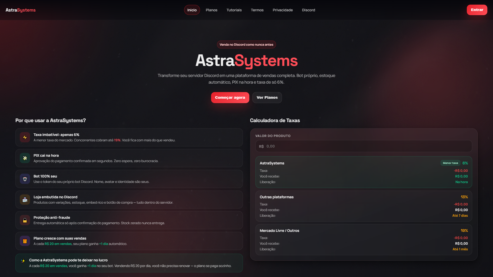
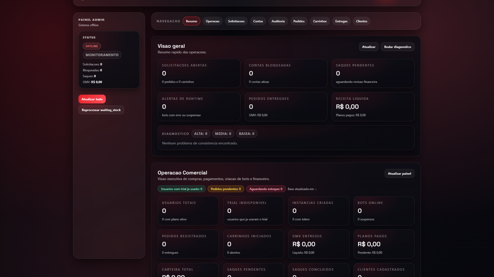
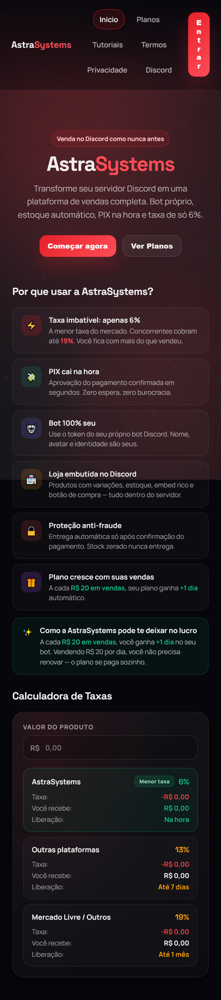

# AstraSystems | Discord Commerce SaaS

Sistema completo de vendas para Discord com bot, portal SaaS, painel admin, carteira financeira e runtime por instancia.


## Sumario
- [Visao do projeto](#sobre-o-projeto)
- [Destaques de portfolio](#destaques-de-portfolio)
- [Stack tecnica](#stack-tecnica)
- [Fluxo ponta a ponta](#fluxo-ponta-a-ponta)
- [Arquitetura](#arquitetura)
- [Funcionalidades principais](#funcionalidades-principais)
- [Estrutura do repositorio](#estrutura-do-repositorio)
- [Como rodar localmente](#como-rodar-localmente)
- [Documentacao complementar](#documentacao-complementar)
- [Capturas de tela](#capturas-de-tela)

## Sobre o projeto
O AstraSystems foi construido para resolver um problema real: vender produtos digitais no Discord com operacao profissional, onboarding simples e controle financeiro centralizado.

Em uma unica base, o projeto entrega:
- Bot de vendas com fluxo de carrinho, pagamento e entrega.
- Portal SaaS para clientes criarem e gerenciarem suas proprias instancias.
- Painel admin para operacao, monitoramento e diagnostico.
- Runtime por instancia com Docker para isolamento e escalabilidade.

## Destaques de portfolio
- Arquitetura multi-tenant: cada cliente opera sua propria instancia, com dados separados.
- Runtime dedicado por instancia: start/stop/restart do bot com monitoramento continuo.
- Integracao com pagamentos e wallet interna: planos, creditos de venda e saques.
- Observabilidade operacional: fila de solicitacoes, logs recentes, visao de negocio e auditoria.
- Persistencia local com escrita atomica em JSON (foco em simplicidade operacional).

## Stack tecnica
- Backend: Node.js, Express, discord.js, axios, dotenv.
- Frontend: React 18 via CDN (portal e admin SPA).
- Pagamentos: Mercado Pago (checkout e webhook), suporte operacional para Asaas.
- Infra: Docker Compose, healthcheck, volumes para `data/` e `logs/`.
- Persistencia: arquivos JSON (`data/*.json` + `data/instances/*`).

## Fluxo ponta a ponta
1. Cliente entra no portal e cria conta (local/OAuth Discord).
2. Ativa trial ou plano pago.
3. Cria instancia e configura token do bot.
4. Vincula a instancia ao servidor Discord.
5. Publica produtos no canal.
6. Comprador abre carrinho, paga e recebe entrega automatica.
7. Receita cai na wallet do dono da instancia.
8. Dono solicita saque; admin acompanha e finaliza.

## Arquitetura
```text
Usuario/Cliente
   |
   +--> Portal SaaS (3100) -------------------+
   |        |                                  |
   |        +--> gestao de instancias          |
   |        +--> planos e checkout             |
   |        +--> wallet e saques               |
   |                                           v
   +--> Discord Bot Runtime (src/index.js) <-> data/portal.json
            |
            +--> carrinho, pedidos, entrega
            +--> posts de produto no Discord
            +--> creditos de venda na wallet
            |
            +--> Painel Admin (3000)
                    +--> operacao/monitoramento
                    +--> catalogo/estoque/cupons
                    +--> auditoria e diagnosticos
```

## Funcionalidades principais
- Carrinho com expiracao por inatividade e confirmacao de compra.
- Postagem e repostagem de produtos em canais do Discord.
- Entrega automatica (DM/canal) com fallback e notificacoes operacionais.
- Catalogo de produtos com variacoes, templates de DM e gestao de estoque.
- Trial + plano pago com renovacao via Mercado Pago.
- Wallet por cliente com solicitacao/cancelamento de saque e fila admin.
- Vinculo de instancia ao servidor Discord via API key.
- Controle de runtime por instancia (`start`, `stop`, `restart`) e leitura de status.

## Estrutura do repositorio
```text
src/
  index.js            # runtime principal do bot
  portalServer.js     # API + SPA do portal (porta 3100)
  adminServer.js      # API + SPA admin (porta 3000)
  portal/             # frontend portal
  admin/              # frontend admin
data/                 # base JSON local (estado da aplicacao)
scripts/              # scripts auxiliares PowerShell (start/stop bot)
docker-compose.yml    # ambiente containerizado
```

## Como rodar localmente
### 1) Requisitos
- Node.js 20+
- npm 10+
- Docker (opcional, para execucao em container)

### 2) Instalacao
```powershell
npm install
Copy-Item .env.example .env
```

### 3) Variaveis essenciais
Configure no `.env`:
- `DISCORD_TOKEN`
- `PORTAL_SESSION_SECRET`
- `DISCORD_OAUTH_CLIENT_ID`
- `DISCORD_OAUTH_CLIENT_SECRET`
- `DISCORD_OAUTH_REDIRECT_URI`
- `MERCADOPAGO_ACCESS_TOKEN` (quando usar checkout/webhook)
- `ADMIN_PANEL_TOKEN` (recomendado para proteger `/admin`)

### 4) Execucao
```powershell
npm start
```

URLs padrao:
- Portal: `http://127.0.0.1:3100`
- Admin: `http://127.0.0.1:3000/admin`
- Health do portal: `http://127.0.0.1:3100/health`
- Status admin: `http://127.0.0.1:3000/api/status`

### 5) Docker Compose
```powershell
docker compose up -d --build
```

Portas expostas: `3000` (admin) e `3100` (portal).  
Volumes: `./data` e `./logs`.

## Documentacao complementar
- Documentacao central: [docs/INDEX.md](./docs/INDEX.md)
- Changelog tecnico: [docs/CHANGELOG.md](./docs/CHANGELOG.md)
- Texto pronto para LinkedIn: [docs/LINKEDIN_POST.md](./docs/LINKEDIN_POST.md)
- Arquitetura tecnica: [docs/ARCHITECTURE.md](./docs/ARCHITECTURE.md)
- Configuracao de ambiente: [docs/CONFIGURATION.md](./docs/CONFIGURATION.md)
- Referencia de API: [docs/API_REFERENCE.md](./docs/API_REFERENCE.md)
- Seguranca: [docs/SECURITY.md](./docs/SECURITY.md)
- Runbook de operacao: [docs/OPERATIONS_RUNBOOK.md](./docs/OPERATIONS_RUNBOOK.md)
- Checklist de deploy/producao: [docs/DEPLOY_CHECKLIST.md](./docs/DEPLOY_CHECKLIST.md)
- Troubleshooting: [docs/TROUBLESHOOTING.md](./docs/TROUBLESHOOTING.md)
- Case de portfolio: [docs/PORTFOLIO_CASE_STUDY.md](./docs/PORTFOLIO_CASE_STUDY.md)
- Galeria de telas: [docs/SCREENSHOTS.md](./docs/SCREENSHOTS.md)

## Capturas de tela
### Home


### Dashboard


### Admin


### Mobile


## Status atual
Projeto ativo e orientado a evolucao continua para operacao SaaS de vendas no Discord.
