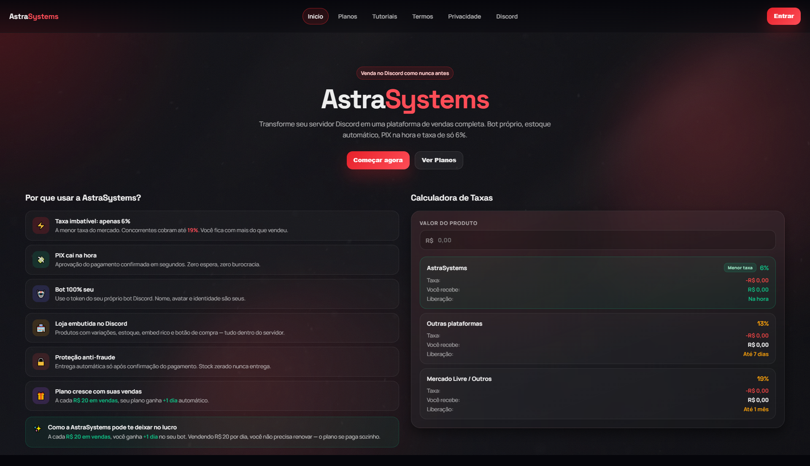
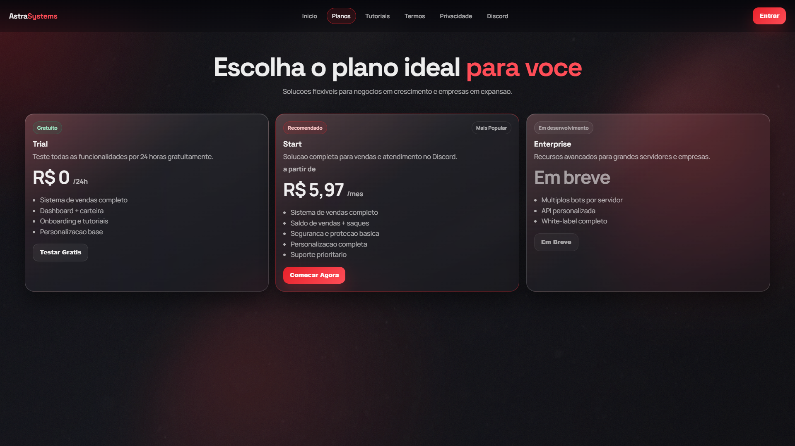
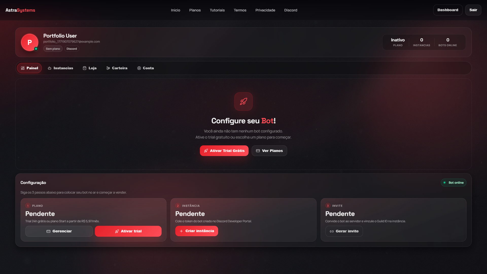
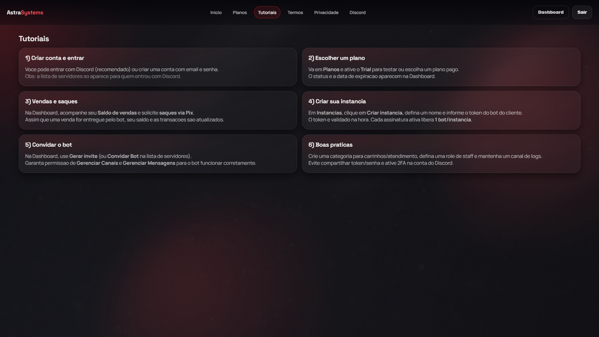

# Galeria de Telas - AstraSystems

Capturas oficiais para portfolio e publicacoes.

## Home


## Plans


## Dashboard


## Tutorials


## Admin


## Regenerar capturas
1. Suba o app local (`npm start` ou `scripts/run-bot.ps1`).
2. Execute:

```powershell
node scripts/capture-screenshots.mjs
```

Arquivos de saida:
- `docs/screenshots/01-home.png`
- `docs/screenshots/02-plans.png`
- `docs/screenshots/03-dashboard.png`
- `docs/screenshots/04-tutorials.png`
- `docs/screenshots/05-admin.png`
