# Galeria de Telas - AstraSystems

Capturas oficiais para portfolio, README e publicacoes.

## Desktop - Portal (publico)
### Home


### Login
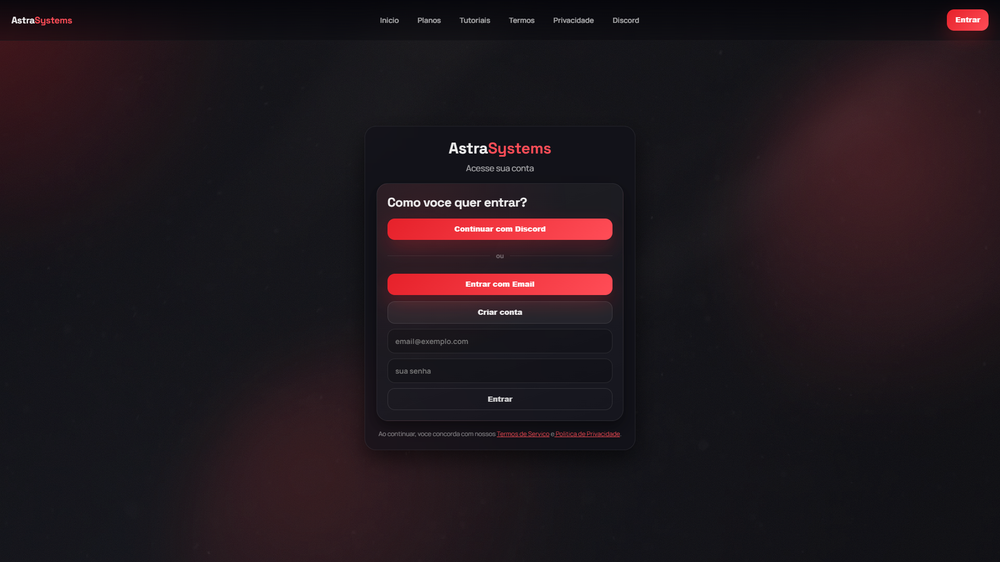

### Plans


### Tutorials
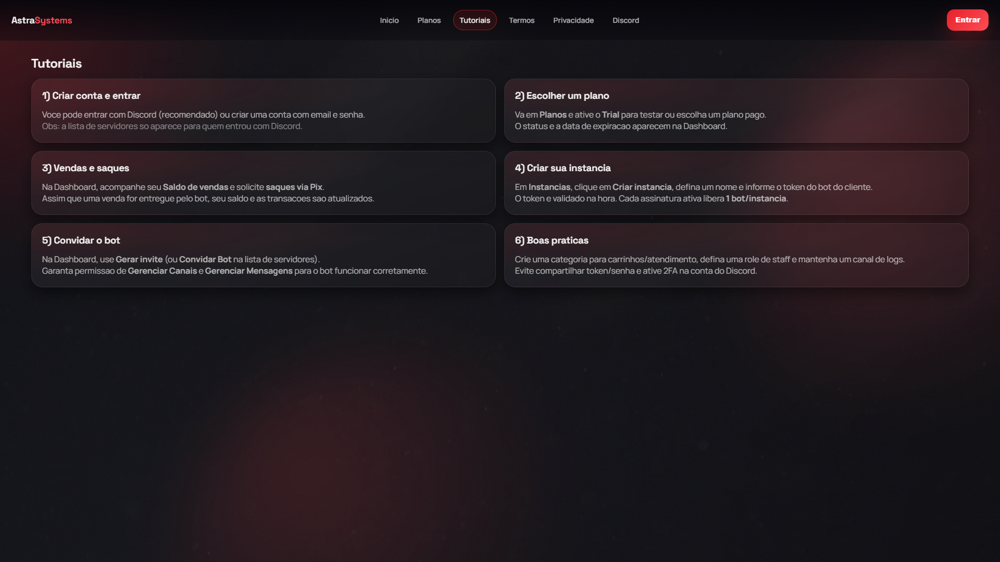

### Terms
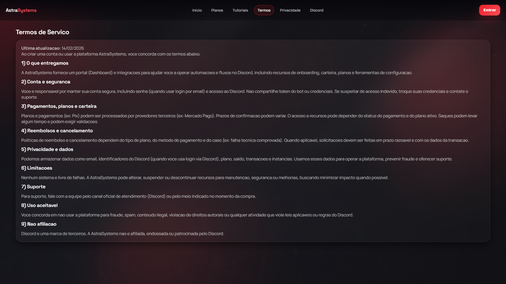

### Privacy
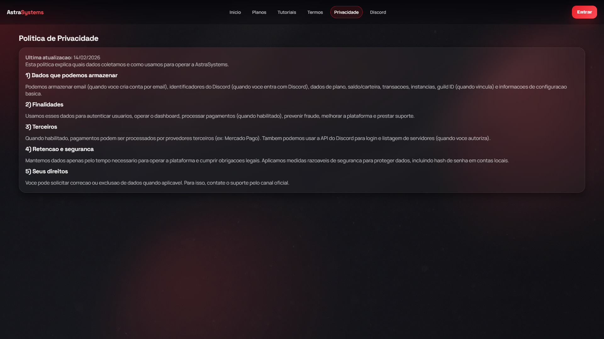

## Desktop - Dashboard (autenticado)
### Overview


### Instances
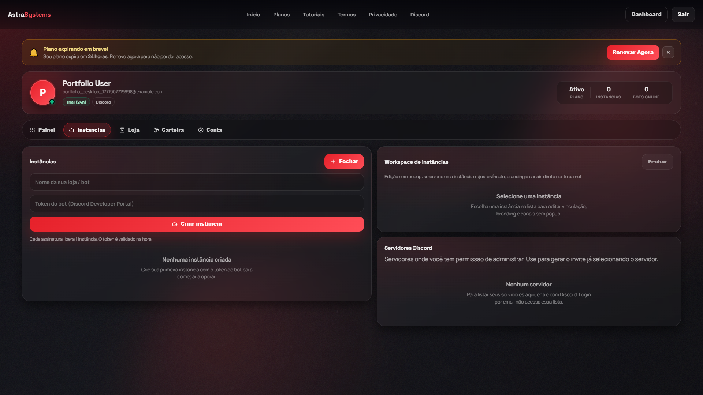

### Store


### Wallet


### Account


## Desktop - Admin
### Admin full page
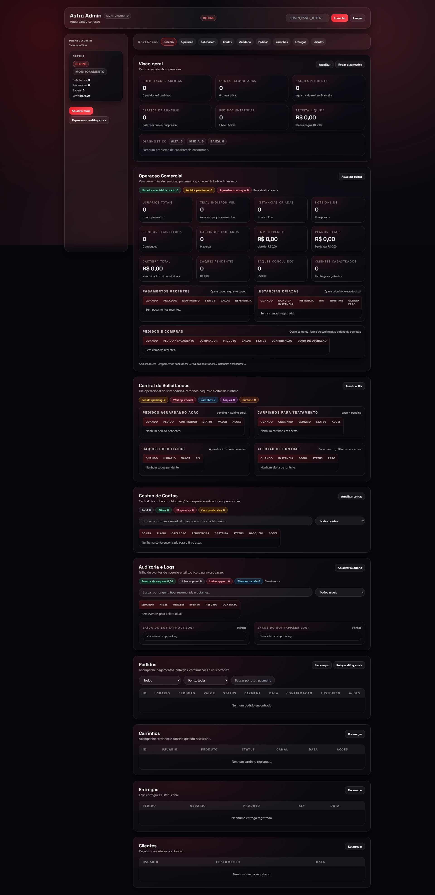

### Resumo


### Operacao
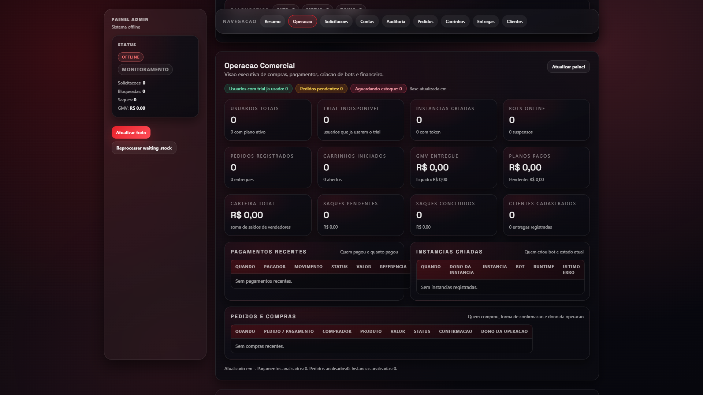

### Solicitacoes
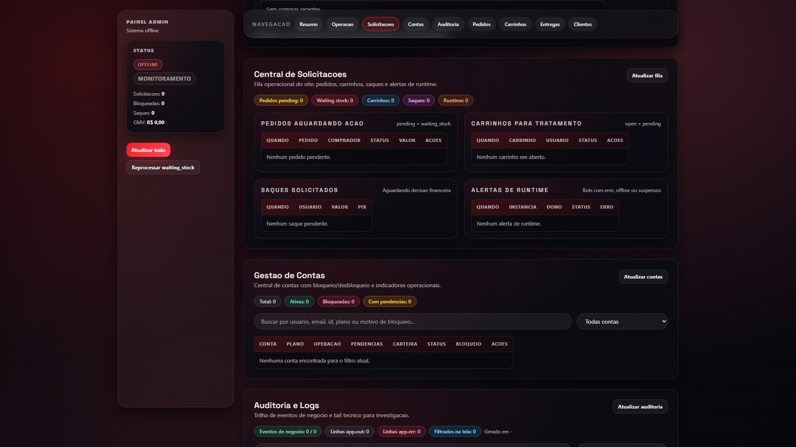

### Contas
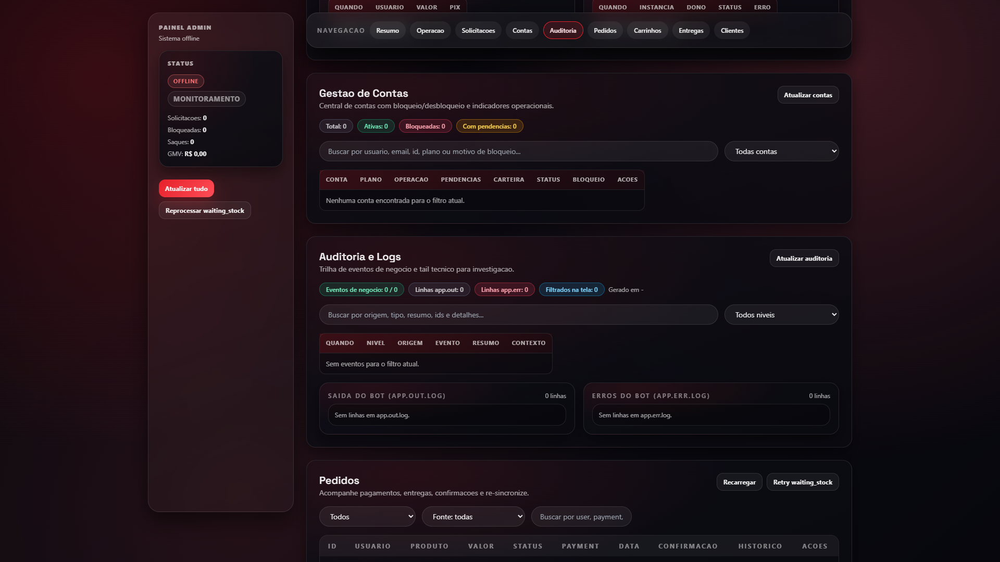

### Auditoria
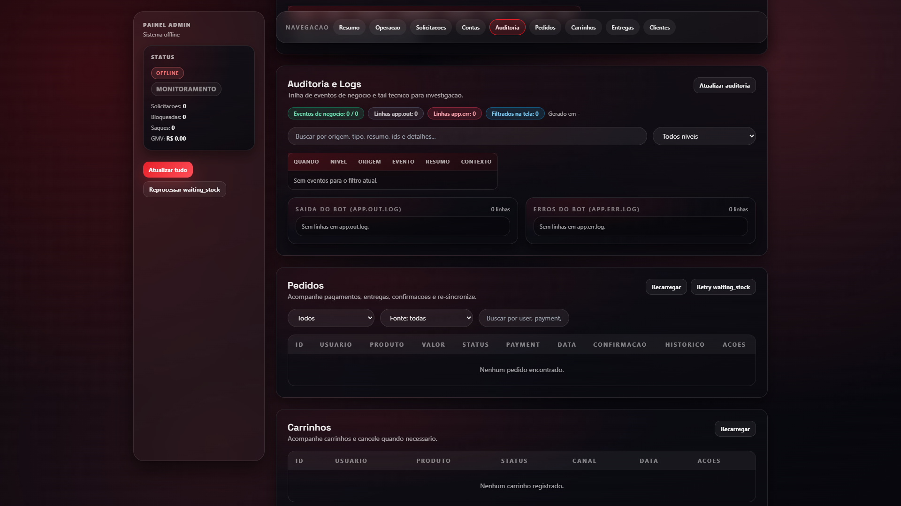

### Pedidos


## Mobile - Portal
### Home mobile


### Plans mobile
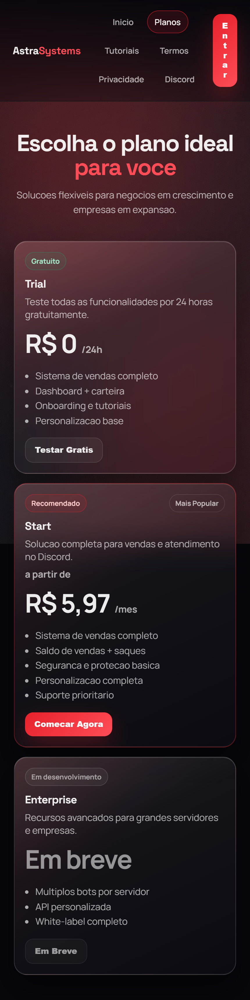

### Dashboard mobile
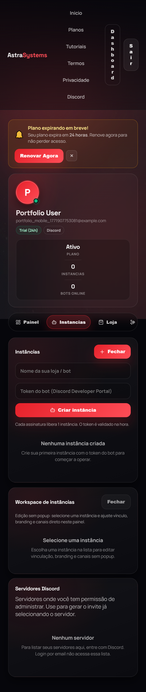

## Regenerar capturas
1. Suba o app local (`npm start` ou `scripts/run-bot.ps1`).
2. Execute:

```powershell
npm run docs:screenshots
```

O script gera automaticamente todos os arquivos `.png` em `docs/screenshots/`.
